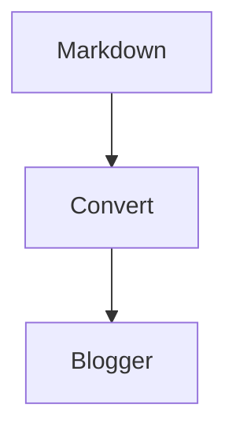

# Example Technical Project

This is a minimal test article for the hexnut-blog-tool.

## Diagram

```mermaid
graph TD
    A[Markdown] --> B[Convert]
    B --> C[Blogger]
```

## Images

Here is a test image (will be rewritten):

More text here.