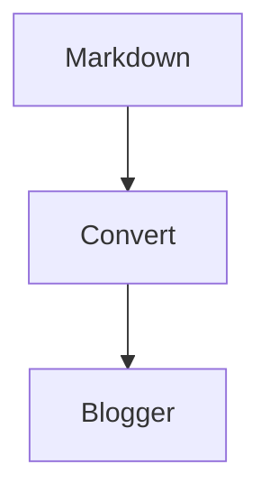

# Voorbeeld Technisch Project

Dit is een minimaal testartikel voor de hexnut-blog-tool.

## Diagram

```mermaid
graph TD
    A[Markdown] --> B[Convert]
    B --> C[Blogger]
```

## Afbeeldingen

Hier een testafbeelding:

Meer tekst.